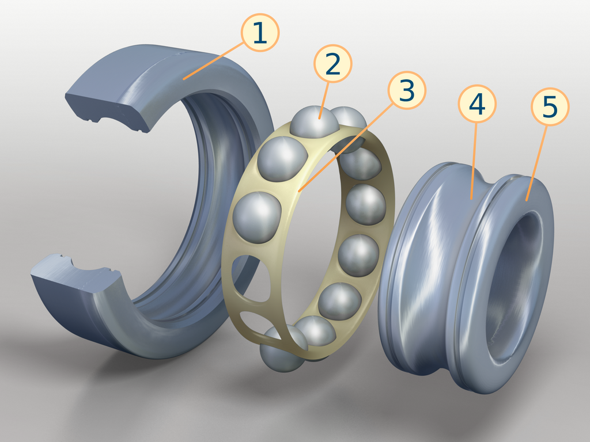

## 1. Введение

**Подшипник качения** — это механический узел, состоящий из внутреннего и наружного кольца, тел качения и сепаратора. Все его части вращаются с разными скоростями, образуя по сути планетарный механизм. Радиальные и радиально-упорные шариковые подшипники относятся к подшипникам качения.

  

Устройство однорядного радиального шарикоподшипника:
1) внешнее кольцо;
2) шарик (тело качения);
3) сепаратор;
4) дорожка качения;
5) внутреннее кольцо.

Подшипники играют важную роль в механизмах и энергосистемах, определяя их надежность и ресурс. Один из главных параметров, который характеризует подшипник, — это его расчетный ресурс (долговечность).

В данной главе рассматриваются основные факторы, влияющие на долговечность подшипников и ключевые методы расчета остаточного ресурса.

>расчет остаточного ресурса для однорядных радиальных шариковых подшипников 204 (ГОСТ 8338-75), установленных на вал диаметром 20 мм.
`УТОЧНИТЬ`

## 2. Термины и определения ГОСТ 18855—2013
- **Ресурс (life):**
Это фактическое число оборотов, которое может сделать один элемент подшипника (обычно внутреннее кольцо относительно наружного или наоборот), прежде чем появятся первые признаки усталостного разрушения — например, трещины или шелушение на телах качения или дорожках качения.

- **Вероятность безотказной работы (reliability):**
Это процент подшипников из большой партии одинаковых подшипников, работающих в одинаковых условиях, которые, по расчетам, смогут отработать заданный ресурс или больше, без разрушений и отказов.

- **Расчётный ресурс (rating life):**
Это ожидаемый срок службы подшипника, который рассчитывается на основе его динамической грузоподъёмности (радиальной или осевой). Он показывает, сколько оборотов подшипник может сделать до начала усталостного разрушения при определённой нагрузке.

- **Динамическая радиальная грузоподъёмность (basic dynamic radial load rating):**
Это постоянная радиальная нагрузка, при которой подшипник должен прослужить 1 миллион оборотов. Это теоретическая величина, полученная в результате стандартных испытаний и расчётов.

- **Динамическая осевая грузоподъёмность (basic dynamic axial load rating):**
То же самое, что и выше, но для осевой (вдоль оси) нагрузки: постоянная нагрузка, при которой подшипник должен выдержать 1 миллион оборотов без разрушения.

- **Динамическая эквивалентная радиальная нагрузка (dynamic equivalent radial load):**
Это такая постоянная радиальная нагрузка, которая оказывает на подшипник такое же влияние на срок службы, как и реальные, переменные или комбинированные нагрузки в условиях работы.

- **Динамическая эквивалентная осевая нагрузка (dynamic equivalent axial load):**
Аналогично предыдущему, но речь идёт об осевой нагрузке. Это расчётная нагрузка, эквивалентная действительной, при которой подшипник покажет такой же ресурс.

- **Номинальный ресурс (basic rating life):**
Это срок службы подшипника, при котором 90% таких же подшипников проработают без разрушения, если они изготовлены из качественного материала и эксплуатируются в нормальных условиях. Это статистическая гарантия надёжности.

- **предел усталостной нагрузки $C_u$ (fatigue load limit) в Ньютонах**: Нагрузка подшипника, при которой в наи­более нагруженном контакте дорожки качения будет достигнут предел усталостного напряжения $\sigma_u$.

## 3. Основные факторы, влияющие на ресурс
Ресурс подшипников зависит от:

- Нагрузки (радиальной и осевой)
- Скорости вращения вала
- Качества смазки и условий эксплуатации
- Температура (перегрев снижает ресурс)
- Монтажные погрешности (перекосы, несоосность).

## 4. Алгоритм расчета

### 4.1 Радиальные и радиально-упорные шариковые подшипники
---
#### 4.1.1 Динамическая радиальная грузоподъемность:
---
Обычно значения статической (C₀) и динамической (C) грузоподъёмности указываются в соответствующем ГОСТе для конкретного типа подшипника.

В случае, если подшипник является нестандартным и значения грузоподъёмности неизвестны, их можно определить расчетным путём с учетом геометрических и конструктивных характеристик подшипника, а также условий его эксплуатации.

Динамическую радиальную грузоподъемность радиальных и радиально-упорных шариковых подшипников вычисляют по формулам:

$$ C_r = b_m \cdot f_c \cdot (i \cdot cos \alpha)^{0.7} \cdot Z^{2/3} \cdot D_w^{1.8} $$

для $Dw$ < 25,4 мм

$$ C_r = 3,647\cdot b_m \cdot f_c \cdot (i \cdot cos \alpha)^{0.7} \cdot Z^{2/3} \cdot D_w^{1.4} $$

для $Dw$ > 25,4 мм

где:
- $C_r$ — динамическая радиальная грузоподъемность в ньютонах
- $b_m$ - оценочный коэффициент для современной, обычно применяемой, закаленной подшипниковой стали хорошего качества, в условиях хорошо налаженного производства, величина которого меняется в зависимости от типа и конструкции подшипника;
- $f_c$ — коэффициент, зависящий от геометрии деталей подшипника, точности изготовления различ­ных деталей и материала;
- $i$ — число рядов тел качения;
- $\alpha$ - номинальный угол контакта в градусах;
- $Z$ - число тел качения в однорядном подшипнике; число тел качения в одном ряду многорядного подшипника с одинаковым числом тел качения в каждом ряду;
- $D_w$ - номинальный диаметр шарика в миллиметрах;

Значения $b_m$ и $f_c$ приведены ниже

| тип подшипника | $b_m$ |
|----------------|-------|
|Радиальный или радиально-упорный шариковый подшипник, вкладышный подшипник и шариковый сферический подшипник | 1,3 |
|Подшипник с пазом для ввода шариков        | 1,1 |

Значение $f_c$ `ГОСТ 18855—2013 Таблица 2`

#### 4.1.2 Динамическая эквивалентная радиальная нагрузка отдельных подшипников
----

Эквивалентная динамическая нагрузка — это расчетная нагрузка, учитывающая реальные условия эксплуатации подшипника, в том числе величину и направление действующих нагрузок, а также тип подшипника.

Перед расчетом эквивалентной динамической радиальной нагрузки необходимо определить значения радиальной и осевой нагрузок, действующих на подшипник в процессе его работы.  

> $F_a$ - осевая нагрузка, действующая вдоль оси подшипника, [Н];  

> $F_r$ -  радиальная нагрузка, действующая перпендикулярно к оси подшипника, [Н];

  

Эти нагрузки определяются из схемы нагружения вала, например, с помощью статического расчёта (уравнения равновесия, разложение сил по осям и т.д.). В результате расчёта получают значения $F_r$ и $F_a$ в каждой точке опоры (где расположен подшипник).

Динамическую эквивалентную радиальную нагрузку радиальных и радиально-упорных шарико­вых подшипников при постоянных радиальной и осевой нагрузках вычисляют по формуле

$$
P_r = X \cdot F_r + Y \cdot F_a
$$

Значения коэффициентов X и У приведены в `ГОСТ 18855—2013 Таблица 3`

#### 4.1.3 Расчет номинального ресурса
---
Одним из наиболее распространенных методов является расчет по формуле Лундберга-Пальмгрена, который лежит в основе стандарта `ГОСТ 18855-2013 (ISO 281:2007). ПОДШИПНИКИ КАЧЕНИЯ. Динамическая грузоподъемность и номинальный ресурс`

$$L_{10} =  ( \frac{C_r}{P_r})^3$$

где:
$L_{10}$ - номинальный ресурс в миллионах оборотах

> Для подшипников с другим уровнем надежности (не 90%) используется поправочный коэффициент $a_1$ из таблиц ГОСТ. Тогда:
>$$L_n = a_1 \cdot L_{10}$$

### 4.1.4 Перевод номинального ресурса в часы 
---

После расчета номинального ресурса в миллионах оборотах, можно перевести его в часы эксплуатации. Для этого используется частота вращения $n$ (в об/мин):

$$L_{10h} = \frac {10^6 \cdot L_{10}}{n \cdot 60} = \frac {10^6}{n \cdot 60}( \frac{C_r}{P_r})^3$$

где:
- $L_{10h}$ - номинальный ресурс в часах (с 90% надежностью),
- $n$ - частота вращения подшипника (об/мин),
- $C_r$ - динамическая грузоподъемность (Н),
- $P_r$ - эквивалентная динамическая нагрузка (Н).

Универсальная формула перевода оборотов в часы:

$$
H = \frac {N}{L_{10}}
$$

где:
- $H$ - расчетное время службы подшипника (в часах)
- $N$ - фактическое число оборотов подшипника (млн оборотов)
- $L$ -  номинальный ресурс подшипника в миллионах оборотов.

4.2 Расчёт усталостного износа