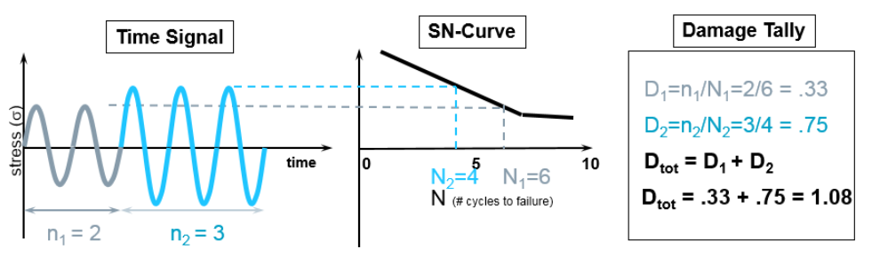

## Алгоритм расчёта остаточного ресурса подшипника при переменных нагрузках и скоростях (по правилу Минера) 

Что нам нужно учитывать:
- Радиальная и осевая нагрузки в каждом режиме: $F_{r_i}$ и $F_{a_i}$
- Частота вращения в об/мин: $n_i$
- Время работы в каждом режиме: $t_i$ (в часах)

### Шаг 1. Разбиваем рабочий цикл на i режимов
Пример
Входные данные:

|Режим | $F_{r_i}$ (Н) | $F_{a_i}$ (Н) | $n_i$ (об/мин) | $t_i$(часы)|
|------|---------------|---------------|----------------|------------|
|1 | 300 | 50 | 1500 | 2|
|2 | 500 | 100 | 1000 | 3|
|3 | 200 | 20 | 1800 | 1|

### Шаг 2. Для каждого режима рассчитываем:

**1. Эквивалентную динамическую нагрузку:**
$$
P_{r_i} = X \cdot F_{r_i} + Y \cdot F_{a_i}
$$
**2. Номинальный ресурс:**
$$L_{10} =  ( \frac{C_r}{P_{r_i}})^3$$
**3. Допустимое число оборотов в режиме i:**
$$N_i = L_{10_i} \cdot 10^6$$
**4.Фактическое число оборотов в режиме i:**
$$n_{факт_i} = n_i \cdot t_i \cdot 60$$
**5. Ущерб (damage) в режиме i:**
$$D_i= \frac {n_{факт_i}}{N_i}$$

### Шаг 3. Суммарный износ по Минеру 
$$D = \sum_{i=1}^{k} \frac {n_{факт_i}}{N_i} $$ 

$D < 1$ → подшипник ещё работает

$D \geq 1$ → ресурс исчерпан, нужна замена

Пример:

|Режим | Нагрузка (Н) | Частота (об/мин) | Время (ч) | $n_i$ (факт) | $N_i$ (допустимо) | $n_i / N_i$|
|-|-|-|-|-|-|-|
|1 | 300 | 1000 | 500 | 30,000,000 | 100,000,000 | 0.30|
|2 | 500 | 1500 | 200 | 18,000,000 | 60,000,000 | 0.30|
|3 | 800 | 800 | 100 | 4,800,000 | 20,000,000 | 0.2|

Суммарный износ:
$$D =0.30+0.30+0.24=0.84$$
Ресурс ещё не исчерпан, износ составляет 84%

